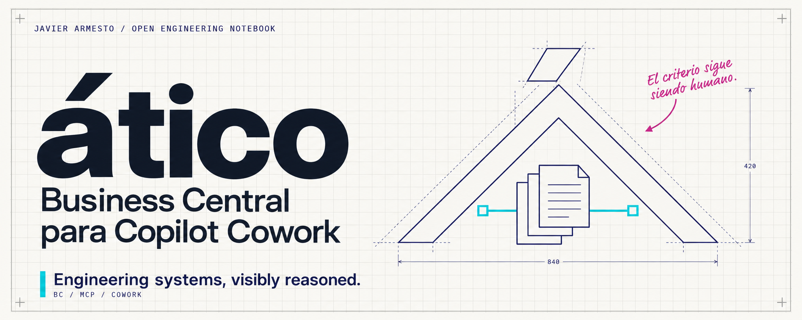

[English](README.md) · [Castellano](README.es.md)

<p align="center"></p>

# ático · Business Central para Copilot Cowork

**Conectar el contexto del ERP con una conversación de trabajo.**

Implementación de referencia de la comunidad para conectar Microsoft 365 Copilot Cowork con Business Central mediante plugins MCP. Despliégala en tu entorno, con tus propias identidades de aplicación y permisos. El repositorio no proporciona un servicio alojado y no es un producto oficial de Microsoft.

## Conexión con Business Central

El plugin conecta Cowork con el **MCP estándar de Business Central** mediante un puente TypeScript con OAuth delegado, descubrimiento dinámico y consultas List sobre páginas API. El puente admite solo lectura.

[Conexión nativa](native/README.es.md) · [Guía de despliegue](native/HOW-TO-BC-NATIVE-COWORK.md)

## Empezar con el MCP estándar

Necesitas Node.js 22+, Git, acceso a plugins personalizados de Cowork, Business Central online con MCP y Dynamic Tool Mode, y los permisos administrativos correspondientes de Entra y Microsoft 365. La disponibilidad depende de las licencias y políticas de tu organización.

```powershell
git clone https://github.com/javiarmesto/Atico-a-Business-Central-M365-Cowork-plugin-guide.git
Set-Location -LiteralPath ".\Atico-a-Business-Central-M365-Cowork-plugin-guide"
npm ci --prefix native/bridge
node native/scripts/init-plugin.mjs
```

Sigue la [guía de despliegue](native/HOW-TO-BC-NATIVE-COWORK.md) para configurar Business Central, Entra, Railway y Teams OAuth. Completa `native/plugin.config.local.json` y genera e instala el paquete. Una plantilla sin configurar no se puede empaquetar correctamente.

La plantilla utiliza tu propia configuración de despliegue e identidad OAuth.

## Documentación

| Tema | English | Castellano |
|---|---|---|
| Conexión nativa | [Overview](native/README.md) | [Resumen](native/README.es.md) |
| Despliegue nativo completo | [Guide](native/HOW-TO-BC-NATIVE-COWORK.en.md) | [Guía](native/HOW-TO-BC-NATIVE-COWORK.md) |
| Descubrimiento dinámico | [Design](native/DYNAMIC-MODE.en.md) | [Diseño](native/DYNAMIC-MODE.md) |
| Artículo | [Read](articles/business-central-cowork-mcp.en.md) | [Leer](articles/business-central-cowork-mcp.es.md) |
| Seguridad y notificación | [Policy](SECURITY.md) | [Política](SECURITY.es.md) |
| Contribuciones | [Guide](CONTRIBUTING.md) | [Guía](CONTRIBUTING.es.md) |
| Identidad visual | [Assets](assets/README.en.md) | [Assets](assets/README.md) |

## Comprobar en local

```powershell
node --test native/scripts/test/package.test.mjs
npm test --prefix native/bridge
node scripts/check-public-files.mjs
```

Estas comprobaciones validan el empaquetado y el comportamiento del puente con dobles de prueba. Debes completar además el inicio de sesión y una lectura autorizada en tu entorno de Cowork y Business Central. Conserva el app ID en las actualizaciones e incrementa la versión al cambiar un paquete instalado. La versión del puente y la del paquete de tu organización son independientes.

Código y documentación: [MIT](LICENSE). Uso y atribución de assets visuales: [identidad de marca](assets/BRAND-USAGE.md). `private: true` en el paquete del puente evita publicarlo accidentalmente en npm; no restringe el uso del repositorio conforme a su licencia.

**Javier Armesto · Open Engineering Notebook**

*Engineering systems, visibly reasoned.*
