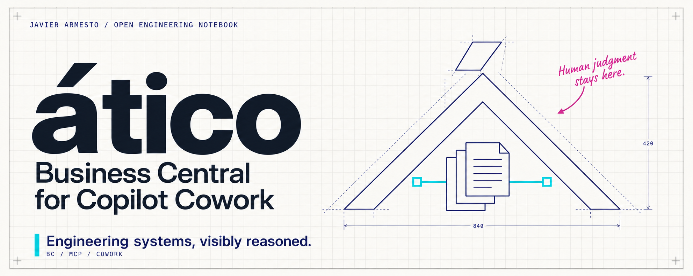

[English](README.md) · [Castellano](README.es.md)

<p align="center"></p>

# ático · Business Central for Copilot Cowork

**Bring ERP context into a work conversation.**

A community reference implementation for connecting Microsoft 365 Copilot Cowork to Business Central through MCP plugins. Deploy it in your own environment, with your own application identities and permissions. This repository does not provide a hosted service and is not an official Microsoft product.

## Choose a connection

| Connection | What is included | Start here |
|---|---|---|
| **Standard Business Central MCP** | A TypeScript bridge with delegated OAuth, dynamic discovery and List queries over API pages. | [Native connection](native/README.md) · [Deployment guide](native/HOW-TO-BC-NATIVE-COWORK.en.md) |
| **Your own Business Central MCP** | An OAuth-configured Cowork package template with a replaceable tool catalog. You provide and secure the server. | [Custom connection](custom/README.md) |

The native bridge supports reads only. The custom template does not enforce permissions on your server: its authentication and tool authorization must be implemented there. The optional [collections example](examples/collections/README.md) illustrates a corporate-session use case; it is not included in the default package.

## Start with the standard MCP

You need Node.js 22+, Git, access to Cowork custom plugins, Business Central online with MCP and Dynamic Tool Mode, and the required Entra and Microsoft 365 administration permissions. Availability depends on your organization's licensing and policies.

```powershell
git clone https://github.com/javiarmesto/Atico-a-Business-Central-M365-Cowork-plugin-guide.git
Set-Location -LiteralPath ".\Atico-a-Business-Central-M365-Cowork-plugin-guide"
npm ci --prefix native/bridge
node native/scripts/init-plugin.mjs
```

Follow the [deployment guide](native/HOW-TO-BC-NATIVE-COWORK.en.md) to configure Business Central, Entra, Railway and Teams OAuth. Fill in `native/plugin.config.local.json`, then generate and install your package. An unconfigured template cannot be packaged successfully.

For your own MCP, start with `node custom/scripts/init-plugin.mjs` and the [custom connection guide](custom/README.md). No author-owned endpoint or OAuth registration is included in either template.

## Documentation

| Topic | English | Castellano |
|---|---|---|
| Native connection | [Overview](native/README.md) | [Resumen](native/README.es.md) |
| Full native deployment | [Guide](native/HOW-TO-BC-NATIVE-COWORK.en.md) | [Guía](native/HOW-TO-BC-NATIVE-COWORK.md) |
| Dynamic tool discovery | [Design](native/DYNAMIC-MODE.en.md) | [Diseño](native/DYNAMIC-MODE.md) |
| Custom MCP connection | [Guide](custom/README.md) | [Guía](custom/README.es.md) |
| Optional collections example | [Example](examples/collections/README.md) | [Ejemplo](examples/collections/README.es.md) |
| Article | [Read](articles/business-central-cowork-mcp.en.md) | [Leer](articles/business-central-cowork-mcp.es.md) |
| Security and reporting | [Policy](SECURITY.md) | [Política](SECURITY.es.md) |
| Contributing | [Guide](CONTRIBUTING.md) | [Guía](CONTRIBUTING.es.md) |
| Visual identity | [Assets](assets/README.en.md) | [Assets](assets/README.md) |

## Verify locally

```powershell
node --test native/scripts/test/package.test.mjs custom/scripts/test/package.test.mjs
npm test --prefix native/bridge
node scripts/check-public-files.mjs
```

These checks validate packaging and bridge behavior with test doubles. They do not replace a sign-in and an authorized read from your own Cowork and Business Central environment. Keep the generated app ID for upgrades and increase your package version when changing an installed package. The bridge version and your organization's package version are independent.

Code and documentation: [MIT](LICENSE). Visual asset and attribution guidance: [brand usage](assets/BRAND-USAGE.md). `private: true` in the bridge package prevents accidental npm publication; it does not restrict use of this repository under its license.

**Javier Armesto · Open Engineering Notebook**

*Engineering systems, visibly reasoned.*
