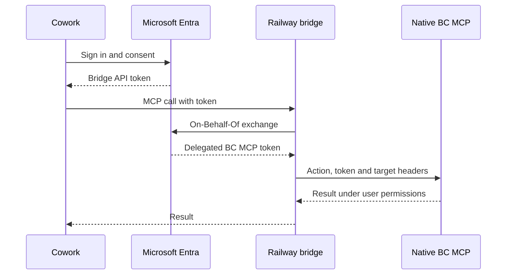

[English](HOW-TO-BC-NATIVE-COWORK.en.md) · [Castellano](HOW-TO-BC-NATIVE-COWORK.md) · [Repository](../README.md)

# Build and deploy a Cowork plugin for the standard Business Central MCP

This guide deploys the reference implementation in `native/`: a Microsoft 365 Copilot Cowork plugin that reads Business Central through Microsoft's native MCP, using delegated authentication and dynamic action discovery. Use Business Central online with MCP and Dynamic Tool Mode available. The walkthrough uses a personal Microsoft 365 installation. Your package version is independent of the bridge version.

## 1. What you will deploy

| Component | Location | Responsibility |
|---|---|---|
| Cowork plugin | ZIP installed in Microsoft 365 | Declares the connector and its tools. |
| MCP bridge | TypeScript service on Railway | Validates incoming tokens, obtains a delegated BC token and supplies target headers. |
| Standard BC MCP | Microsoft service and configuration in BC | Discovers and executes permitted actions over ERP APIs. |

The native endpoint is `https://mcp.businesscentral.dynamics.com`. Your plugin points to `https://<bridge-domain>/mcp`. The bridge supplies the tenant, environment, company and configuration headers.



Two app registrations are used: an OAuth client for Cowork and an API for the bridge. Secrets authenticate the applications; they do not replace the user identity or BC permissions. See [Microsoft's OBO reference](https://learn.microsoft.com/en-us/entra/identity-platform/v2-oauth2-on-behalf-of-flow).

The bridge supports `List` queries over API pages with read-only OData parameters. It exposes `bc_connection_check`, `bc_actions_search`, `bc_actions_describe` and `bc_actions_invoke`. Dynamic mode lets you add supported entities in BC without adding one tool per entity to the ZIP or an entity allowlist in Railway. This implementation does not create, update, delete or post documents and does not expose `resources/read`.

## 2. Prerequisites

| Area | Requirement |
|---|---|
| Microsoft 365 | Access to Copilot Cowork and custom plugins, subject to licensing, availability and organizational policies. |
| Business Central | Online environment with MCP and Dynamic Tool Mode; a company and user authorized for the APIs to query. |
| BC administration | `MCP - ADMIN` or equivalent configuration permissions. |
| Microsoft Entra | Permission to register applications and an administrator able to grant tenant consent. |
| Teams Developer Portal | Access to register OAuth client configuration. |
| GitHub and Railway | Repository access for Railway's GitHub integration and permission to create a service and variables. |
| Development machine | Git, Node.js 22+, npm and PowerShell for these commands. |

Check that Cowork is available and that custom app installation is permitted before starting. Organization-wide distribution requires the appropriate Microsoft 365 administration process.

```powershell
npm install -g @microsoft/m365agentstoolkit-cli
node --version
atk --version
```

Use an Agents Toolkit version compatible with Cowork plugins. The [Microsoft guide](https://learn.microsoft.com/en-us/microsoft-365/copilot/cowork/cowork-plugin-development) specifies version 1.1.12 or later.

## 3. Prepare the repository

```powershell
git clone https://github.com/javiarmesto/Atico-a-Business-Central-M365-Cowork-plugin-guide.git
Set-Location -LiteralPath ".\Atico-a-Business-Central-M365-Cowork-plugin-guide"
npm ci --prefix native/bridge
npm run build --prefix native/bridge
```

For your own maintained deployment, fork the repository and clone your fork. Select that repository in Railway.

| Path | Purpose |
|---|---|
| `native/bridge/src/config.ts` | Variables, destination and headers. |
| `native/bridge/src/auth.ts` | Incoming token validation and OBO. |
| `native/bridge/src/server.ts` | MCP endpoint and health check. |
| `native/bridge/src/native.ts` | Communication with Microsoft MCP. |
| `native/bridge/src/dynamic.ts` | Dynamic action validation and read adaptation. |
| `native/appPackage/tools/bc-native-dynamic.json` | Catalog of the four public bridge tools. |
| `native/scripts/build-package.mjs` | Package generator. |
| `native/appPackage/manifest.template.json` and `native/appPackage/icons/` | Native package template and icons. |
| `native/plugin.config.example.json` | Identity, branding, endpoint and OAuth reference fields. |
| `native/Dockerfile` | Railway service build and startup. |

## 4. Configure Business Central

In the target company, open **Model Context Protocol (MCP) Server Configurations** and create:

| Field | Value |
|---|---|
| Name | `cowork-dynamic` |
| Description | `Business queries from Microsoft 365 Copilot Cowork` |
| Active | Enabled |
| Default | Disabled; the bridge selects the configuration by name. |
| Dynamic Tool Mode | Enabled |
| Discover Additional Objects | Disabled initially. |
| Unblock Edit Tools | Disabled |

Under **Available Tools → Select Tools**, add these API pages and enable only **Allow Read**:

| Entity | Object ID | API version |
|---|---:|---|
| APIV2 - Items | 30008 | v2.0 |
| APIV2 - Customers | 30009 | v2.0 |
| APIV2 - Vendors | 30010 | v2.0 |
| APIV2 - Sales Invoices | 30012 | v2.0 |

Save and run **Validate**. Under **Advanced → Connection String**, collect `TenantId`, `EnvironmentName`, `Company` and `ConfigurationName`, preserving exact spelling, spaces and punctuation. BC configuration controls API exposure, while the user's permissions still apply. [BC MCP configuration](https://learn.microsoft.com/en-us/dynamics365/business-central/dev-itpro/ai/configure-mcp-server).

## 5. Register the bridge API in Entra

In the **tenant hosting Business Central**:

1. Open **Microsoft Entra ID → App registrations → New registration**.
2. Name it `BC Native Bridge API` and select **Accounts in this organizational directory only / Single tenant**.
3. Register it. Save the **Application (client) ID** as `BRIDGE_CLIENT_ID` and the **Directory (tenant) ID** as `BC_TENANT_ID`.

This API registration needs no redirect URI for this flow.

Under **Expose an API**, set the Application ID URI to `api://<BRIDGE_CLIENT_ID>`. Add and enable `access_as_user`, with administrator consent. Use a display name such as `Access Business Central through the bridge` and describe access on behalf of the user.

In the manifest, set `api.requestedAccessTokenVersion` to `2` while retaining the other properties. The verifier requires v2 access tokens intended for this API.

Under **API permissions → Add a permission → Microsoft APIs → Dynamics 365 Business Central → Delegated permissions**, add `Financials.ReadWrite.All` and grant administrator consent. [Microsoft registration guidance](https://learn.microsoft.com/en-us/dynamics365/business-central/dev-itpro/ai/use-mcp-server-non-microsoft).

The bridge requests `https://mcp.businesscentral.dynamics.com/.default` in OBO. The MCP's discovery metadata is at `https://mcp.businesscentral.dynamics.com/.well-known/oauth-protected-resource`. Although the delegated permission includes `ReadWrite` in its name, the bridge restricts calls to reads; BC also applies its configuration and effective user permissions.

Create a client secret under **Certificates & secrets**. Store its **Value**, not its identifier, in the approved secret manager. It will be `BRIDGE_CLIENT_SECRET` in Railway. Record the expiry date for renewal.

## 6. Register the Cowork OAuth client

Create a second **single-tenant** app registration in the BC tenant, named `BC Native Cowork Client`:

1. Save its **Application (client) ID** as `COWORK_CLIENT_ID`.
2. Under **Authentication**, add the **Web** platform with the exact redirect URI `https://teams.microsoft.com/api/platform/v1.0/oAuthRedirect`.
3. Under **API permissions → Add a permission → My APIs**, choose `BC Native Bridge API` and delegated `access_as_user`.
4. Grant administrator consent.
5. Create a client secret and retain its **Value** for Teams Developer Portal.

[Microsoft OAuth configuration](https://learn.microsoft.com/en-us/microsoft-365/copilot/extensibility/plugin-authentication-oauth).

| Value | Destination |
|---|---|
| BC tenant ID | `BC_TENANT_ID` and Entra endpoints. |
| Bridge API client ID | `BRIDGE_CLIENT_ID` and bridge scope URI. |
| Bridge API secret | Railway `BRIDGE_CLIENT_SECRET` only. |
| Cowork client ID | Railway `COWORK_CLIENT_ID` and Teams OAuth client registration. |
| Cowork client secret | Teams OAuth registration. |
| Teams Auth config ID | Package `authorization.referenceId`. |
| M365 application ID | `manifest.id`, identifying the installed plugin, not an Entra app. |

An Entra **Object ID** does not replace its **Application (client) ID**. Keep secrets and tokens out of the ZIP and Git.

If M365 and BC are in different tenants, install the package with the M365 account. OAuth uses the BC tenant endpoints and an account with actual BC access. Both registrations stay in the BC tenant; each bridge deployment has a fixed BC destination. Permit the relevant M365 organizations in Teams OAuth configuration. Cross-tenant and conditional-access policies must allow sign-in; guest membership alone grants no BC license or permissions.

## 7. Deploy the bridge on Railway

1. Create a service using **Deploy from GitHub repo** and authorize Railway's GitHub integration for your repository.
2. Select the branch containing `native/`.
3. Set **Root Directory** to `/native` and use its Dockerfile.
4. Keep its startup command, `node dist/src/server.js`.
5. Set **Healthcheck Path** to `/healthz`.
6. Generate an HTTPS domain in **Networking**, targeting port `3000`.

The Dockerfile installs dependencies, compiles TypeScript and starts the service. Enter the following service variables; company and configuration names should have no enclosing quotes in Railway's editor:

| Variable | Value |
|---|---|
| `BC_TENANT_ID` | BC tenant GUID. |
| `BC_ENVIRONMENT_NAME` | Exact environment name, for example `Sandbox`. |
| `BC_COMPANY` | Exact company name, for example `CRONUS USA, Inc.`. |
| `BC_CONFIGURATION_NAME` | `cowork-dynamic` |
| `BC_TOOL_MODE` | `dynamic` |
| `BRIDGE_PUBLIC_URL` | `https://<bridge-domain>`; origin only, without `/mcp`. |
| `BRIDGE_CLIENT_ID` | Bridge API application ID. |
| `BRIDGE_CLIENT_SECRET` | Bridge API client secret value. |
| `COWORK_CLIENT_ID` | Cowork OAuth client application ID. |
| `PORT` | `3000` |

The code defaults to `static`; set `BC_TOOL_MODE=dynamic` explicitly. `native/.env.example` contains placeholders and is not loaded automatically. Enter variables in the Railway service. The bridge maps them to `TenantId`, `EnvironmentName`, `Company` and `ConfigurationName`, and encodes non-ASCII header values.

Deploy and check `https://<bridge-domain>/healthz`. It should report `status: ok`, the bridge version and `toolMode: dynamic`. This proves process availability; BC connectivity is checked after Cowork sign-in.

## 8. Register OAuth in Teams Developer Portal

Sign in to [Teams Developer Portal](https://dev.teams.microsoft.com/) with the M365 tenant account. Open **Tools → OAuth client registration → New OAuth client registration**.

| Field | Value |
|---|---|
| Registration name | `BC Native Cowork` |
| Base URL | `https://<bridge-domain>/mcp` |
| Restrict usage by org | `My organization only`, or `Any Microsoft 365 organization` if required for the cross-tenant setup. |
| Restrict usage by app | `Any Teams app` |
| Client ID | Cowork OAuth client application ID. |
| Client secret | Cowork OAuth client secret value. |
| Authorization endpoint | `https://login.microsoftonline.com/<BC_TENANT_ID>/oauth2/v2.0/authorize` |
| Token / Refresh endpoint | `https://login.microsoftonline.com/<BC_TENANT_ID>/oauth2/v2.0/token` |
| Scope | `api://<BRIDGE_CLIENT_ID>/access_as_user,offline_access` |
| PKCE | Enabled |

Enter scopes separated by a comma in this form. Save and copy the complete **OAuth client registration ID / Auth config ID** to `oauthReferenceId` in your package's local configuration. It can be an opaque Base64-like identifier; do not transform it. The `Any Teams app` selection follows the MCP integration described by [Microsoft](https://learn.microsoft.com/en-us/microsoft-365/copilot/extensibility/plugin-authentication-oauth).

## 9. Configure and generate the package

From the repository root:

```powershell
node native/scripts/init-plugin.mjs
```

This creates `native/plugin.config.local.json` with a new stable GUID. Re-running preserves the existing file and identity. Git and the Docker context exclude this file.

| Field | Value |
|---|---|
| `appId` | Keep the generated GUID, or explicitly use an existing M365 app ID when upgrading it. |
| `version` | Start at `1.0.0`; increase for package updates. |
| `mode` | `dynamic`, matching Railway's `BC_TOOL_MODE`. |
| `endpoint` | `https://<bridge-domain>/mcp` |
| `oauthReferenceId` | Complete Teams Auth config ID. |
| `name`, `description` | Your organization's plugin identity, in the audience's language. |
| `developer` | Publisher name and actual HTTPS website, privacy and terms URLs. |

Replace the 192 × 192 `color.png` and the 32 × 32 white/transparent `outline.png` in `native/appPackage/icons/` for your own branding. No secrets belong in the configuration.

```powershell
node native/scripts/build-package.mjs
# Optional alternative configuration:
# node native/scripts/build-package.mjs --config ".\native\another-organization.local.json"
```

The generator validates inputs, replaces only `native/build/appPackage/` and preserves local configuration. The dynamic catalog is `tools/bc-native-dynamic.json`; entities are discovered in BC at runtime. Check the output manifest for schema version `1.28`, your bridge `/mcp` URL, `OAuthPluginVault`, the correct reference ID and catalog path.

```powershell
$manifestPath = ".\native\build\appPackage\manifest.json"
$pluginVersion = (Get-Content -LiteralPath $manifestPath -Raw | ConvertFrom-Json).version
$zipPath = Join-Path (Get-Location) "native\build\bc-native-dynamic-v$pluginVersion.zip"
atk package --manifest-file $manifestPath --output-package-file $zipPath --output-folder ".\native\build\packaged"
```

The ZIP has `manifest.json`, `color.png` and `outline.png` at its root, plus `tools/bc-native-dynamic.json`. The native package includes no collections skill.

## 10. Install and connect in Cowork

In the same PowerShell session:

```powershell
atk auth login m365
if (-not (Test-Path -LiteralPath $zipPath -PathType Leaf)) {
    throw "Package not found: $zipPath"
}
atk install --file-path $zipPath --scope Personal
```

Choose the M365 account where you use Cowork. Open Cowork's plugin settings, find your configured plugin name, enable it and select **Connect** for its MCP server. Sign in with an account authorized for the target BC environment. Start a new task and select the plugin if needed. Refresh Cowork if it was already open during installation; interface labels may vary by language.

## 11. Run the first queries

First check the destination:

> Use BC Native to check the connection. Show the environment, company and MCP configuration used.

Then read business data:

> List the first five vendors, ordered by number. Show number and name. Do not modify data.

> List the five most recent sales invoices by posting date. Show number, date, customer, total including tax, currency and status. Use only available fields and do not assume a missing currency.

The connector searches for an action, describes its schema and executes the read. Confirm that results belong to the selected company. A connection check and an actual read are separate verification steps.

## 12. Add APIs and maintain the deployment

In BC's `cowork-dynamic` configuration, add a supported API page, enable **Allow Read** and save. The same dynamic tools can discover and query it. Enabling **Discover Additional Objects** broadens discovery to accessible API pages, subject to permissions and bridge support; it does not automatically turn every table into an API.

| Change | Update |
|---|---|
| Add a supported read API page | BC MCP configuration. |
| Change target company, environment or configuration | Railway variables. |
| Change bridge code with the same MCP contract | Deploy the updated branch in Railway. |
| Change exposed tool names or schemas | Align bridge and catalog; generate and install an updated package. |
| Change public URL or Auth config ID | OAuth registration and package as appropriate; update `BRIDGE_PUBLIC_URL` when the origin changes. |
| Renew Bridge API secret | Railway `BRIDGE_CLIENT_SECRET` and redeploy. |
| Renew Cowork client secret | Teams OAuth registration. |
| Distribute to more users | Microsoft 365 administration publication and assignment. |

Keep the manifest ID for updates and increase the package version when the package changes. Supporting writes would require an explicit implementation change; enabling BC edit permissions does not enable writes in this bridge.
