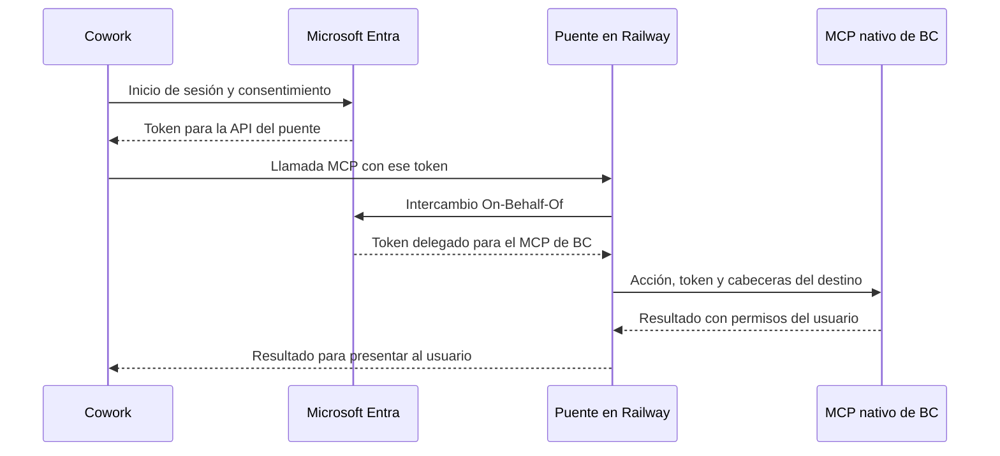

[English](HOW-TO-BC-NATIVE-COWORK.en.md) · [Castellano](HOW-TO-BC-NATIVE-COWORK.md) · [Repositorio](../README.es.md)

# Cómo crear y desplegar un plugin de Cowork para el MCP estándar de Business Central

Guía para construir un complemento de Microsoft 365 Copilot Cowork que consulte Business Central mediante el MCP nativo de Microsoft, con autenticación delegada y descubrimiento dinámico de acciones.

La implementación de referencia está en la carpeta `native/` de este repositorio. La guía utiliza Business Central online con MCP y Dynamic Tool Mode disponibles y una instalación personal del complemento en Microsoft 365. La versión del paquete se define en tu configuración local, independientemente de la versión del puente.

## 1. Qué vas a desplegar

La solución tiene tres piezas:

| Pieza | Dónde se implementa | Responsabilidad |
|---|---|---|
| Plugin de Cowork | Paquete ZIP instalado en Microsoft 365 | Declara el complemento, su conector y las herramientas disponibles. |
| Puente MCP | Servicio TypeScript en Railway | Autentica las llamadas, obtiene un token delegado para BC e incorpora las cabeceras del destino. |
| MCP estándar de Business Central | Servicio de Microsoft y configuración dentro de BC | Descubre y ejecuta las acciones permitidas sobre las API del ERP. |

El endpoint nativo es `https://mcp.businesscentral.dynamics.com`. El plugin apunta a `https://<dominio-del-puente>/mcp`. El puente resuelve las cabeceras de tenant, entorno, empresa y configuración, además del intercambio de tokens.

### Identidad del usuario



Se utilizan dos registros de aplicaciones: un cliente OAuth para Cowork y una API para el puente. El acceso a BC se realiza en nombre del usuario. Los secretos autentican las aplicaciones; no sustituyen la identidad ni los permisos del usuario. [Referencia del flujo OBO](https://learn.microsoft.com/en-us/entra/identity-platform/v2-oauth2-on-behalf-of-flow).

### Alcance de esta implementación

El puente admite consultas `List` sobre páginas API con parámetros OData de lectura. Expone `bc_connection_check`, `bc_actions_search`, `bc_actions_describe` y `bc_actions_invoke`.

El modo dinámico permite añadir entidades desde BC sin añadir una herramienta por entidad al ZIP ni una lista de nombres en Railway. Esta implementación está limitada a lectura: no crea, modifica, elimina ni registra documentos. Tampoco publica `resources/read`.

## 2. Prerrequisitos

| Área | Necesitas |
|---|---|
| Microsoft 365 | Una cuenta con acceso habilitado a Copilot Cowork y a complementos personalizados, según las licencias, disponibilidad y políticas de la organización. |
| Business Central | Un entorno online con MCP y Dynamic Tool Mode disponibles; empresa y usuario con acceso a las API que se van a consultar. |
| Administración BC | El conjunto de permisos `MCP - ADMIN` o permisos equivalentes para configurar el servidor MCP. |
| Microsoft Entra | Permiso para crear aplicaciones y una persona con capacidad para conceder consentimiento de administrador en el tenant de BC. |
| Teams Developer Portal | Acceso para registrar la configuración OAuth del complemento. |
| GitHub y Railway | Un repositorio accesible desde la integración GitHub de Railway y permisos para crear un servicio y sus variables. |
| Equipo de desarrollo | Git, Node.js 22 o posterior, npm y PowerShell para los comandos de esta guía. |

Comprueba que Cowork aparece en tu cuenta y que la organización permite instalar aplicaciones personalizadas antes de comenzar. La instalación descrita utiliza el alcance personal; la distribución a toda la organización requiere su proceso administrativo de publicación.

Instala Microsoft 365 Agents Toolkit CLI:

```powershell
npm install -g @microsoft/m365agentstoolkit-cli
node --version
atk --version
```

Usa una versión de Agents Toolkit compatible con plugins de Cowork; la documentación indica 1.1.12 o posterior. [Desarrollo de plugins para Cowork](https://learn.microsoft.com/en-us/microsoft-365/copilot/cowork/cowork-plugin-development).

## 3. Preparar el repositorio

Clona el repositorio desde su rama principal:

```powershell
git clone https://github.com/javiarmesto/Atico-a-Business-Central-M365-Cowork-plugin-guide.git
Set-Location -LiteralPath ".\Atico-a-Business-Central-M365-Cowork-plugin-guide"
```

Para mantener una solución propia, crea un fork en GitHub y clona su URL. En Railway seleccionarás ese repositorio y la rama que contenga `native/`.

Estos son los archivos que intervienen:

| Ruta desde la raíz | Uso |
|---|---|
| `native/bridge/src/config.ts` | Variables, destino MCP y cabeceras. |
| `native/bridge/src/auth.ts` | Validación del token entrante e intercambio OBO. |
| `native/bridge/src/server.ts` | Endpoint MCP y comprobación de salud. |
| `native/bridge/src/native.ts` | Comunicación con el MCP de Microsoft. |
| `native/bridge/src/dynamic.ts` | Adaptación de las acciones dinámicas a consultas de lectura. |
| `native/appPackage/tools/bc-native-dynamic.json` | Catálogo de las cuatro herramientas que publica el puente. |
| `native/scripts/build-package.mjs` | Generación del manifiesto y archivos del paquete. |
| `native/Dockerfile` | Construcción y arranque del servicio en Railway. |
| `native/appPackage/manifest.template.json` y `native/appPackage/icons/` | Plantilla e iconos independientes del paquete nativo. |
| `native/plugin.config.example.json` | Campos de identidad, marca, endpoint y referencia OAuth que debes completar. |

Instala las dependencias y compila:

```powershell
npm ci --prefix native/bridge
npm run build --prefix native/bridge
```

## 4. Configurar Business Central

En la empresa de destino, busca **Model Context Protocol (MCP) Server Configurations** y crea una configuración:

| Campo | Valor para esta guía |
|---|---|
| Name | `cowork-dynamic` |
| Description | `Consultas de negocio desde Microsoft 365 Copilot Cowork` |
| Active | Activado |
| Default | Desactivado; el puente selecciona la configuración por nombre. |
| Dynamic Tool Mode | Activado |
| Discover Additional Objects | Desactivado para comenzar con las API seleccionadas. |
| Unblock Edit Tools | Desactivado |

En **Available Tools**, usa **Select Tools** para añadir las siguientes páginas y permite únicamente **Allow Read**:

| Entidad | Object ID | API Version |
|---|---:|---|
| Artículos — APIV2 - Items | 30008 | v2.0 |
| Clientes — APIV2 - Customers | 30009 | v2.0 |
| Proveedores — APIV2 - Vendors | 30010 | v2.0 |
| Facturas de venta — APIV2 - Sales Invoices | 30012 | v2.0 |

Guarda y ejecuta **Validate**. En **Advanced → Connection String**, recoge `TenantId`, `EnvironmentName`, `Company` y `ConfigurationName`. Conserva los nombres exactos, incluidos espacios y signos de puntuación.

La configuración controla qué API ofrece el MCP; los permisos del usuario siguen aplicándose. [Configuración del MCP de Business Central](https://learn.microsoft.com/en-us/dynamics365/business-central/dev-itpro/ai/configure-mcp-server).

## 5. Registrar la API del puente en Microsoft Entra

Trabaja en el **tenant que aloja Business Central**.

1. Abre **Microsoft Entra ID → App registrations → New registration**.
2. Nombre: `BC Native Bridge API`.
3. Tipos de cuenta: **Accounts in this organizational directory only / Single tenant**.
4. Registra la aplicación y copia su **Application (client) ID**. Será `BRIDGE_CLIENT_ID`.
5. Copia también el **Directory (tenant) ID**. Será `BC_TENANT_ID`.

Esta aplicación recibe tokens como API; no necesita una redirect URI para el flujo descrito.

### Exponer el permiso del puente

En **Expose an API**:

- Application ID URI: `api://<BRIDGE_CLIENT_ID>`.
- Añade el scope `access_as_user`.
- Consentimiento: administradores.
- Nombre visible: `Acceder a Business Central mediante el puente`.
- Descripción: `Permite consultar Business Central en nombre del usuario mediante el puente MCP`.
- Estado: habilitado.

En **Manifest**, establece `api.requestedAccessTokenVersion` en `2`, conservando las demás propiedades. El verificador del puente espera tokens de acceso v2 destinados a esta API.

### Permiso delegado hacia Business Central

En **API permissions → Add a permission → Microsoft APIs → Dynamics 365 Business Central → Delegated permissions**, añade `Financials.ReadWrite.All`. Concede consentimiento de administrador para el tenant. [Registro de aplicaciones para clientes del MCP de BC](https://learn.microsoft.com/en-us/dynamics365/business-central/dev-itpro/ai/use-mcp-server-non-microsoft).

El código solicita el scope OBO `https://mcp.businesscentral.dynamics.com/.default`. El recurso público de descubrimiento del MCP es `https://mcp.businesscentral.dynamics.com/.well-known/oauth-protected-resource`; la audiencia del token saliente corresponde al MCP nativo.

Aunque el permiso delegado se denomina `ReadWrite`, esta implementación limita sus llamadas a lectura y BC aplica la configuración MCP y los permisos efectivos del usuario.

### Secreto de la API

En **Certificates & secrets → New client secret**, crea una credencial y guarda su **Value** en el gestor de secretos autorizado. Ese valor se introducirá únicamente como `BRIDGE_CLIENT_SECRET` en Railway. Anota su caducidad para renovarlo.

## 6. Registrar el cliente OAuth de Cowork

En el mismo tenant de BC, crea un segundo registro:

1. Nombre: `BC Native Cowork Client`.
2. Tipo de cuenta: **Single tenant**.
3. Copia su **Application (client) ID**: será `COWORK_CLIENT_ID`.
4. En **Authentication**, añade la plataforma **Web** y esta redirect URI exacta:

```text
https://teams.microsoft.com/api/platform/v1.0/oAuthRedirect
```

5. En **API permissions → Add a permission → My APIs**, selecciona `BC Native Bridge API` y su permiso delegado `access_as_user`.
6. Concede consentimiento de administrador.
7. Crea un secreto de cliente. Guarda su **Value** para introducirlo en Teams Developer Portal.

[Configuración OAuth de plugins de Microsoft 365](https://learn.microsoft.com/en-us/microsoft-365/copilot/extensibility/plugin-authentication-oauth).

### Dónde va cada identificador y secreto

| Dato | Destino |
|---|---|
| Tenant ID de BC | `BC_TENANT_ID` y endpoints de Entra. |
| Client ID de Bridge API | `BRIDGE_CLIENT_ID` y URI del scope `access_as_user`. |
| Secreto de Bridge API | Solo `BRIDGE_CLIENT_SECRET` en Railway. |
| Client ID de Cowork Client | `COWORK_CLIENT_ID` en Railway y Client ID en el registro OAuth de Teams. |
| Secreto de Cowork Client | Registro OAuth de Teams Developer Portal. |
| Auth config ID que generará Teams | `authorization.referenceId` del paquete. |
| ID de la aplicación M365 | `manifest.id`; identifica el plugin instalado, no un registro de Entra. |

El **Object ID** de Entra no sustituye al **Application (client) ID**. El ZIP y el repositorio no contienen secretos ni tokens.

### Si Microsoft 365 y Business Central están en tenants distintos

El paquete se instala con la cuenta del tenant M365. La conexión OAuth utiliza los endpoints del tenant BC y una cuenta que tenga acceso efectivo a ese BC. Los dos registros anteriores permanecen en el tenant de BC; el puente admite un destino fijo por despliegue.

En Teams, permite el uso del registro OAuth desde las organizaciones M365 que correspondan. Las políticas de acceso entre tenants y de acceso condicional deben permitir el inicio de sesión. Ser invitado en un directorio, por sí solo, no concede licencia ni permisos en BC.

## 7. Desplegar el puente en Railway

1. Crea un proyecto o un servicio nuevo en Railway mediante **Deploy from GitHub repo**.
2. Autoriza a la integración GitHub de Railway a acceder al repositorio, si todavía no está incluido entre los repositorios permitidos.
3. Selecciona el repositorio y la rama que contiene `native/`.
4. Configura **Root Directory**: `/native`.
5. Utiliza el **Dockerfile** incluido en esa raíz.
6. Deja el arranque definido por el Dockerfile: `node dist/src/server.js`.
7. Configura **Healthcheck Path**: `/healthz`.
8. En **Networking**, genera el dominio público HTTPS y dirige el tráfico al puerto `3000`.

El Dockerfile instala dependencias, compila TypeScript y arranca el servicio. No necesitas subir manualmente los archivos compilados.

### Variables del servicio

Introduce los valores siguientes en **Variables**. En el editor de variables de Railway, los nombres de empresa y configuración se escriben sin comillas envolventes.

| Variable | Valor |
|---|---|
| `BC_TENANT_ID` | GUID del tenant de BC. |
| `BC_ENVIRONMENT_NAME` | Nombre exacto del entorno, por ejemplo `Sandbox`. |
| `BC_COMPANY` | Nombre exacto de la empresa, por ejemplo `CRONUS USA, Inc.`. |
| `BC_CONFIGURATION_NAME` | `cowork-dynamic` |
| `BC_TOOL_MODE` | `dynamic` |
| `BRIDGE_PUBLIC_URL` | `https://<dominio-del-puente>`; solo el origen, sin `/mcp`. |
| `BRIDGE_CLIENT_ID` | Client ID de `BC Native Bridge API`. |
| `BRIDGE_CLIENT_SECRET` | Valor del secreto de `BC Native Bridge API`. |
| `COWORK_CLIENT_ID` | Client ID de `BC Native Cowork Client`. |
| `PORT` | `3000` |

El modo predeterminado del código es `static`: configura expresamente `BC_TOOL_MODE=dynamic` para esta guía. Los valores de destino de `native/.env.example` son marcadores genéricos y deben sustituirse por los de tu entorno. No se carga ese archivo automáticamente: en Railway introduce las variables en el servicio.

El puente transforma estas variables en las cabeceras `TenantId`, `EnvironmentName`, `Company` y `ConfigurationName`. También codifica los nombres con caracteres no ASCII en el formato que espera el MCP.

Aplica las variables y despliega. El servicio debe quedar en estado **Success**. Abre:

```text
https://<dominio-del-puente>/healthz
```

La respuesta debe indicar `status: ok`, la versión del puente y `toolMode: dynamic`. Este endpoint confirma que el proceso está disponible; la conexión con BC se completa al iniciar sesión desde Cowork.

## 8. Crear la configuración OAuth en Teams Developer Portal

Abre [Teams Developer Portal](https://dev.teams.microsoft.com/) con la cuenta del tenant M365. Ve a **Tools → OAuth client registration → New OAuth client registration**.

| Campo | Valor |
|---|---|
| Registration name | `BC Native Cowork` |
| Base URL | `https://<dominio-del-puente>/mcp` |
| Restrict usage by org | `My organization only` para una organización; `Any Microsoft 365 organization` cuando deba utilizarse entre tenants. |
| Restrict usage by app | `Any Teams app` |
| Client ID | Client ID de `BC Native Cowork Client`. |
| Client secret | Valor del secreto de `BC Native Cowork Client`. |
| Authorization endpoint | `https://login.microsoftonline.com/<BC_TENANT_ID>/oauth2/v2.0/authorize` |
| Token endpoint | `https://login.microsoftonline.com/<BC_TENANT_ID>/oauth2/v2.0/token` |
| Refresh endpoint | `https://login.microsoftonline.com/<BC_TENANT_ID>/oauth2/v2.0/token` |
| Scope / Ámbito | `api://<BRIDGE_CLIENT_ID>/access_as_user,offline_access` |
| PKCE | Activado |

Introduce los scopes separados por coma en este formulario. La plataforma los procesa para la petición OAuth. Guarda y copia el **OAuth client registration ID / Auth config ID** completo: se introduce como `oauthReferenceId` en la configuración local del paquete. Puede ser un identificador opaco con caracteres de Base64; consérvalo sin transformarlo.

La selección `Any Teams app` corresponde a la integración MCP descrita por Microsoft. [Referencia de registro OAuth](https://learn.microsoft.com/en-us/microsoft-365/copilot/extensibility/plugin-authentication-oauth).

## 9. Definir el plugin y generar su paquete

### Inicializar la configuración local

Desde la raíz del repositorio:

```powershell
node native/scripts/init-plugin.mjs
```

El comando crea `native/plugin.config.local.json` con un GUID nuevo y estable para tu aplicación. Al ejecutarlo otra vez conserva el archivo y su identidad. El archivo está excluido de Git y del contexto Docker.

Completa estos campos en el JSON:

| Campo | Qué introducir |
|---|---|
| `appId` | Mantén el GUID generado. Para actualizar una aplicación que ya existe, introduce su ID M365 antes de generar el paquete. |
| `version` | Versión de tu plugin, inicialmente `1.0.0`. Incrementa al actualizar su paquete. |
| `mode` | `dynamic`; debe coincidir con `BC_TOOL_MODE` en Railway. |
| `endpoint` | `https://<dominio-del-puente>/mcp` |
| `oauthReferenceId` | Auth config ID completo de Teams Developer Portal. |
| `name` y `description` | Nombre y propósito del complemento de tu organización. |
| `developer` | Nombre del desarrollador y URLs HTTPS de sitio web, privacidad y términos. |

El ID M365, el nombre y las URLs se configuran sin editar código. El archivo no admite secretos: los valores de los dos secretos se mantienen en Railway y Teams, respectivamente.

Los iconos de ejemplo están en `native/appPackage/icons/`: puedes sustituir `color.png` (192 × 192) y `outline.png` (32 × 32) por los de tu organización. El generador utiliza exclusivamente la plantilla y los iconos de `native/`.

### Generar los archivos

```powershell
node native/scripts/build-package.mjs
```

Si mantienes varias configuraciones, puedes indicar una explícitamente:

```powershell
node native/scripts/build-package.mjs --config ".\native\otra-organizacion.local.json"
```

El generador comprueba la configuración y escribe `native/build/appPackage/manifest.json`, los iconos y el catálogo seleccionado. Sustituye únicamente la carpeta de salida generada; conserva tu configuración local. Rechaza campos incompletos para evitar empaquetar valores de ejemplo.

El catálogo dinámico es `native/appPackage/tools/bc-native-dynamic.json`. Sus cuatro herramientas se mantienen estables y las entidades se descubren desde BC durante la conversación. No necesitas copiar herramientas del entorno ni editar una lista por API.

En el manifiesto resultante, comprueba estos valores:

| Propiedad | Contenido |
|---|---|
| `manifestVersion` | `1.28` |
| `agentConnectors[0].toolSource.remoteMcpServer.mcpServerUrl` | URL HTTPS del puente terminada en `/mcp`. |
| `mcpToolDescription.file` | `tools/bc-native-dynamic.json` |
| `authorization.type` | `OAuthPluginVault` |
| `authorization.referenceId` | Auth config ID de Teams. |

### Crear el ZIP

```powershell
$manifestPath = ".\native\build\appPackage\manifest.json"
$pluginVersion = (Get-Content -LiteralPath $manifestPath -Raw | ConvertFrom-Json).version
$zipPath = Join-Path (Get-Location) "native\build\bc-native-dynamic-v$pluginVersion.zip"

atk package --manifest-file $manifestPath --output-package-file $zipPath --output-folder ".\native\build\packaged"
```

El ZIP debe contener `manifest.json`, `color.png` y `outline.png` en su raíz, y el catálogo en `tools/bc-native-dynamic.json`. El paquete nativo generado no incorpora la skill de cobros del otro complemento del repositorio.

## 10. Instalar y conectar en Cowork

En la misma ventana de PowerShell, después de generar el ZIP:

```powershell
atk auth login m365

if (-not (Test-Path -LiteralPath $zipPath -PathType Leaf)) {
    throw "No se encuentra el paquete: $zipPath"
}

atk install --file-path $zipPath --scope Personal
```

Elige la cuenta M365 donde utilizarás Cowork. Una vez completada la instalación:

1. Abre Cowork y entra en **Personalizar → Complementos**.
2. Localiza **BC Nativo**, o el nombre que hayas configurado.
3. Activa el complemento y abre su ficha.
4. En **Servidores MCP**, pulsa **Conectar**.
5. Completa el login con la cuenta que tenga acceso a Business Central en el tenant de destino.
6. Crea una tarea nueva y selecciona el complemento si no está ya disponible para esa tarea.

Si Cowork estaba abierto durante la instalación, actualiza la página o vuelve a abrir la aplicación para cargar el complemento.

## 11. Primera consulta

Primero comprueba el destino:

> Usa BC Nativo para comprobar la conexión. Indica el entorno, la empresa y la configuración MCP utilizados.

Después solicita información de negocio:

> Consulta los primeros cinco proveedores, ordenados por número. Muestra número y nombre. No modifiques datos.

Para las facturas:

> Consulta las cinco facturas de venta más recientes por fecha de registro. Muestra número, fecha, cliente, importe con impuestos, divisa y estado. Usa únicamente campos disponibles y no asumas la moneda si falta.

El complemento busca una acción, consulta su esquema y ejecuta la lectura. El resultado debe corresponder a la empresa elegida. La comprobación de conexión y la consulta de registros son dos pasos distintos de la puesta en marcha.

## 12. Añadir más API y mantener el despliegue

Para una nueva entidad, abre `cowork-dynamic` en BC, añade su página API, habilita **Allow Read** y guarda. Cowork puede descubrirla y consultarla mediante las mismas herramientas dinámicas. No hay una lista por entidad que mantener en Railway.

Si deseas ampliar el descubrimiento a otras páginas API accesibles, activa **Discover Additional Objects** en BC. El alcance continúa condicionado por los permisos del usuario y por las consultas que soporta el puente. Una tabla de BC no se convierte automáticamente en API por activar esta opción.

| Cambio | Qué debes actualizar |
|---|---|
| Añadir una página API compatible en lectura | Configuración MCP de BC. |
| Cambiar empresa, entorno o configuración de destino | Variables del servicio Railway. |
| Cambiar código del puente manteniendo el contrato MCP | Desplegar la rama actualizada en Railway. |
| Cambiar nombres o esquemas de herramientas publicadas | Catálogo y puente coherentes; generar e instalar un paquete actualizado. |
| Cambiar la URL pública o el Auth config ID | Registro OAuth y paquete donde corresponda; actualizar `BRIDGE_PUBLIC_URL` si cambia el origen. |
| Renovar el secreto de Bridge API | `BRIDGE_CLIENT_SECRET` en Railway y redespliegue. |
| Renovar el secreto de Cowork Client | Registro OAuth en Teams. |
| Distribuir a más usuarios | Publicación y asignación mediante la administración de Microsoft 365. |

Mantén el ID del manifiesto para actualizar el mismo plugin. Si cambias el paquete, incrementa su versión. Para ampliar el puente a operaciones de escritura es necesario diseñar ese comportamiento y modificar su implementación; activar permisos de edición en BC no habilita escrituras en esta versión.
